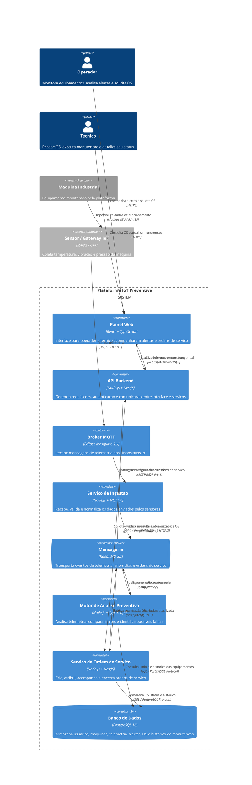

```mermaid
C4Container
    Person(operador, "Operador", "Monitora equipamentos, analisa alertas e solicita OS")
    Person(tecnico, "Tecnico", "Recebe OS, executa manutencao e atualiza seu status")

    System_Ext(maquina, "Maquina Industrial", "Equipamento monitorado pela plataforma")
    Container_Ext(sensor, "Sensor / Gateway IoT", "ESP32 / C++", "Coleta temperatura, vibracao e pressao da maquina")

    System_Boundary(plataforma, "Plataforma IoT Preventiva") {

        Container(web, "Painel Web", "React + TypeScript", "Interface para operador e tecnico acompanharem alertas e ordens de servico")

        Container(api, "API Backend", "Node.js + NestJS", "Gerencia requisicoes, autenticacao e comunicacao entre interface e servicos")

        Container(mqtt, "Broker MQTT", "Eclipse Mosquitto 2.x", "Recebe mensagens de telemetria dos dispositivos IoT")

        Container(ingestao, "Servico de Ingestao", "Node.js + MQTT.js", "Recebe, valida e normaliza os dados enviados pelos sensores")

        ContainerQueue(rabbit, "Mensageria", "RabbitMQ 3.x", "Transporta eventos de telemetria, anomalias e ordens de servico")

        Container(analise, "Motor de Analise Preventiva", "Node.js + TypeScript", "Analisa telemetria, compara limites e identifica possiveis falhas")

        Container(os, "Servico de Ordem de Servico", "Node.js + NestJS", "Cria, atribui, acompanha e encerra ordens de servico")

        ContainerDb(banco, "Banco de Dados", "PostgreSQL 16", "Armazena usuarios, maquinas, telemetria, alertas, OS e historico de manutencao")
    }

    Rel(operador, web, "Acompanha alertas e solicita OS", "HTTPS")

    Rel(tecnico, web, "Consulta OS e atualiza manutencao", "HTTPS")

    Rel(web, api, "Envia requisicoes e consultas", "REST / JSON / HTTPS")

    Rel(api, web, "Atualiza informacoes em tempo real", "WebSocket / WSS")

    Rel(maquina, sensor, "Disponibiliza dados de funcionamento", "Modbus RTU / RS-485")

    Rel(sensor, mqtt, "Publica telemetria", "MQTT 5.0 / TLS")

    Rel(mqtt, ingestao, "Entrega mensagens dos sensores", "MQTT 5.0")

    Rel(ingestao, rabbit, "Publica telemetria.normalizada", "AMQP 0-9-1")

    Rel(rabbit, analise, "Entrega eventos de telemetria", "AMQP 0-9-1")

    Rel(analise, rabbit, "Publica anomalia.detectada", "AMQP 0-9-1")

    Rel(rabbit, os, "Entrega eventos de anomalias", "AMQP 0-9-1")

    Rel(api, os, "Solicita criacao, consulta e atualizacao de OS", "gRPC / Protocol Buffers / HTTP/2")

    Rel(os, banco, "Armazena OS, status e historico", "SQL / PostgreSQL Protocol")

    Rel(analise, banco, "Consulta limites e historico dos equipamentos", "SQL / PostgreSQL Protocol")

    Rel(os, rabbit, "Publica eventos de OS criada e atualizada", "AMQP 0-9-1")

    Rel(rabbit, api, "Entrega atualizacoes das ordens de servico", "AMQP 0-9-1")
```