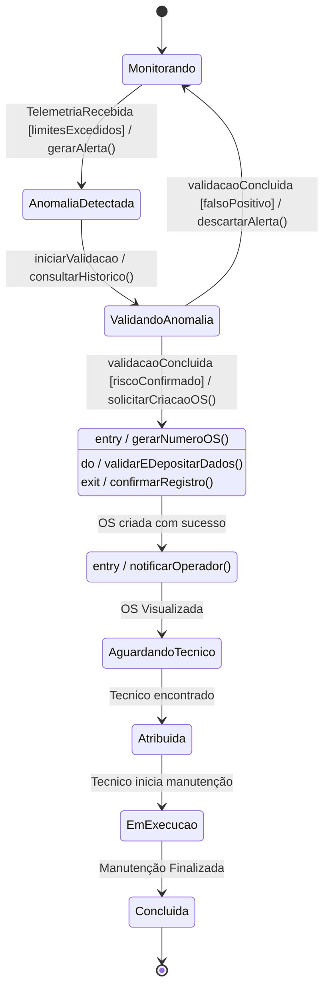

```mermaid
stateDiagram-v2
    [*] --> Monitorando

    Monitorando --> AnomaliaDetectada : TelemetriaRecebida [limitesExcedidos] / gerarAlerta()

    AnomaliaDetectada --> ValidandoAnomalia : iniciarValidacao / consultarHistorico()

    ValidandoAnomalia --> Monitorando : validacaoConcluida [falsoPositivo] / descartarAlerta()

    ValidandoAnomalia --> Registrando : validacaoConcluida [riscoConfirmado] / solicitarCriacaoOS()

    Registrando : entry / gerarNumeroOS()
    Registrando : do / validarEDepositarDados()
    Registrando : exit / confirmarRegistro()

    Registrando --> Criada : OS criada com sucesso

    Criada : entry / notificarOperador()
    Criada --> AguardandoTecnico : OS Visualizada

    AguardandoTecnico --> Atribuida : Tecnico encontrado

    Atribuida --> EmExecucao : Tecnico inicia manutenção

    EmExecucao --> Concluida : Manutenção Finalizada

    Concluida --> [*]
```