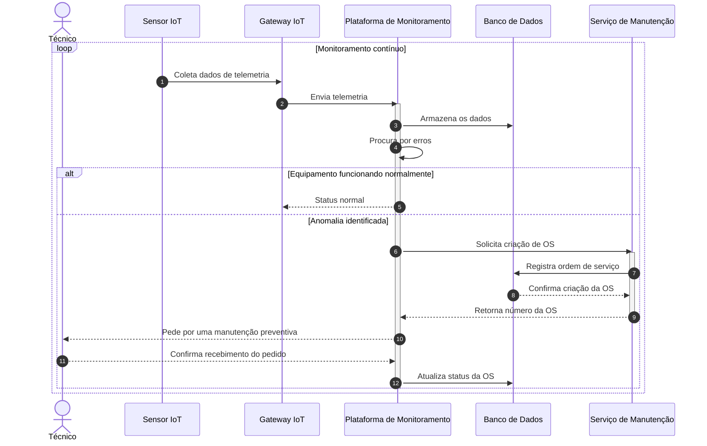

```mermaid

sequenceDiagram
    autonumber

    actor Tecnico as Técnico
    participant Sensor as Sensor IoT
    participant Gateway as Gateway IoT
    participant Plataforma as Plataforma de Monitoramento
    participant Banco as Banco de Dados
    participant OS as Serviço de Manutenção

    loop Monitoramento contínuo
        Sensor->>Gateway: Coleta dados de telemetria
        Gateway->>Plataforma: Envia telemetria
        activate Plataforma

        Plataforma->>Banco: Armazena os dados
        

        Plataforma->>Plataforma: Procura por erros

        alt Equipamento funcionando normalmente
            Plataforma-->>Gateway: Status normal
        else Anomalia identificada
            Plataforma->>OS: Solicita criação de OS
            activate OS

            OS->>Banco: Registra ordem de serviço
            Banco-->>OS: Confirma criação da OS

            OS-->>Plataforma: Retorna número da OS
            deactivate OS

            Plataforma-->>Tecnico: Pede por uma manutenção preventiva
            Tecnico-->>Plataforma: Confirma recebimento do pedido

            Plataforma->>Banco: Atualiza status da OS
        end

        deactivate Plataforma
    end

```