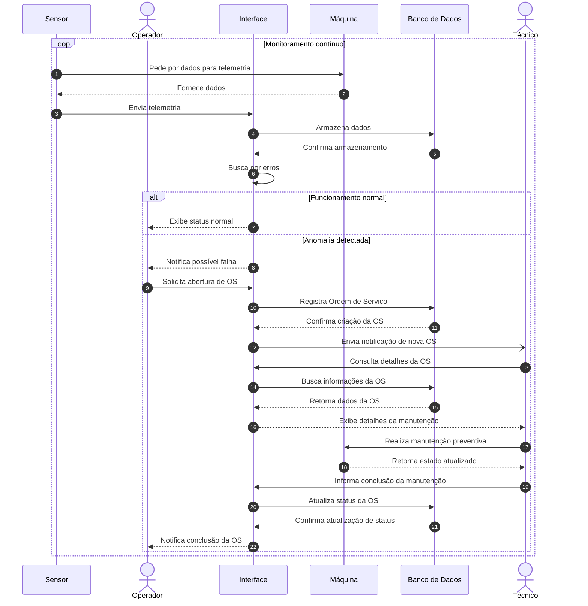

```mermaid
sequenceDiagram
    autonumber

    participant Sensor
    actor Operador
    participant Interface
    participant Maquina as Máquina
    participant BD as Banco de Dados
    actor Tecnico as Técnico

    loop Monitoramento contínuo
        Sensor->>Maquina: Pede por dados para telemetria
        Maquina-->>Sensor: Fornece dados

        Sensor->>Interface: Envia telemetria
        Interface->>BD: Armazena dados
        BD-->>Interface: Confirma armazenamento

        Interface->>Interface: Busca por erros

        alt Funcionamento normal
            Interface-->>Operador: Exibe status normal
        else Anomalia detectada
            Interface-->>Operador: Notifica possível falha

            Operador->>Interface: Solicita abertura de OS
            Interface->>BD: Registra Ordem de Serviço
            BD-->>Interface: Confirma criação da OS

            Interface-)Tecnico: Envia notificação de nova OS

            Tecnico->>Interface: Consulta detalhes da OS
            Interface->>BD: Busca informações da OS
            BD-->>Interface: Retorna dados da OS
            Interface-->>Tecnico: Exibe detalhes da manutenção

            Tecnico->>Maquina: Realiza manutenção preventiva
            Maquina-->>Tecnico: Retorna estado atualizado

            Tecnico->>Interface: Informa conclusão da manutenção
            Interface->>BD: Atualiza status da OS
            BD-->>Interface: Confirma atualização de status

            Interface-->>Operador: Notifica conclusão da OS
        end
    end
```
