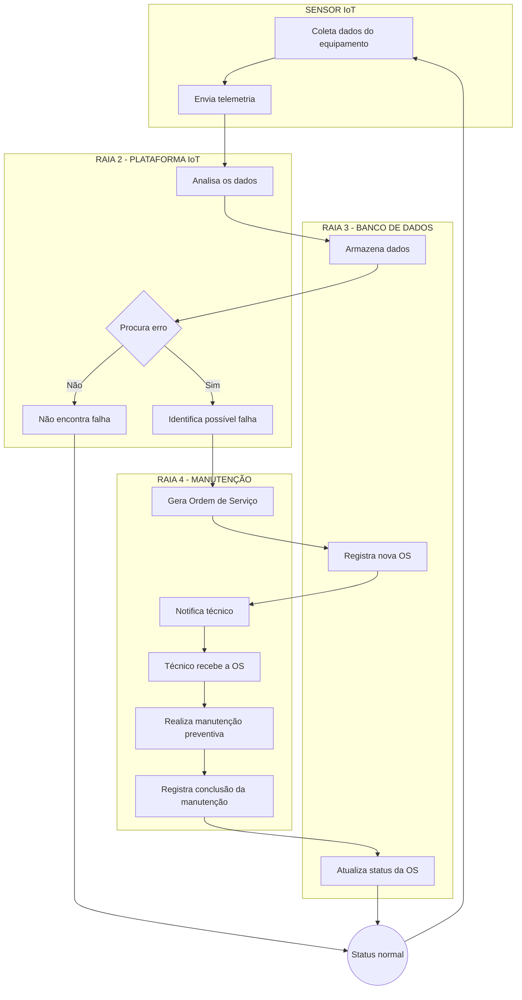

```mermaid
flowchart TB

    subgraph R1["SENSOR IoT"]
        A["Coleta dados do equipamento"]
        B["Envia telemetria"]
    end

    subgraph R2["RAIA 2 - PLATAFORMA IoT"]
        D["Analisa os dados"]
        E{"Procura erro"}
        F["Não encontra falha"]
        G["Identifica possível falha"]
    end

    subgraph R3["RAIA 3 - BANCO DE DADOS"]
        H["Armazena dados"]
        I["Registra nova OS"]
        J["Atualiza status da OS"]
    end

    subgraph R4["RAIA 4 - MANUTENÇÃO"]
        K["Gera Ordem de Serviço"]
        L["Notifica técnico"]
        M["Técnico recebe a OS"]
        N["Realiza manutenção preventiva"]
        O["Registra conclusão da manutenção"]
    end

    Normal(("Status normal"))

    A --> B
    B --> D
    D --> H
    H --> E

    E -->|Não| F
    F --> Normal
    Normal --> A

    E -->|Sim| G
    G --> K
    K --> I
    I --> L
    L --> M
    M --> N
    N --> O
    O --> J
    J --> Normal
```
